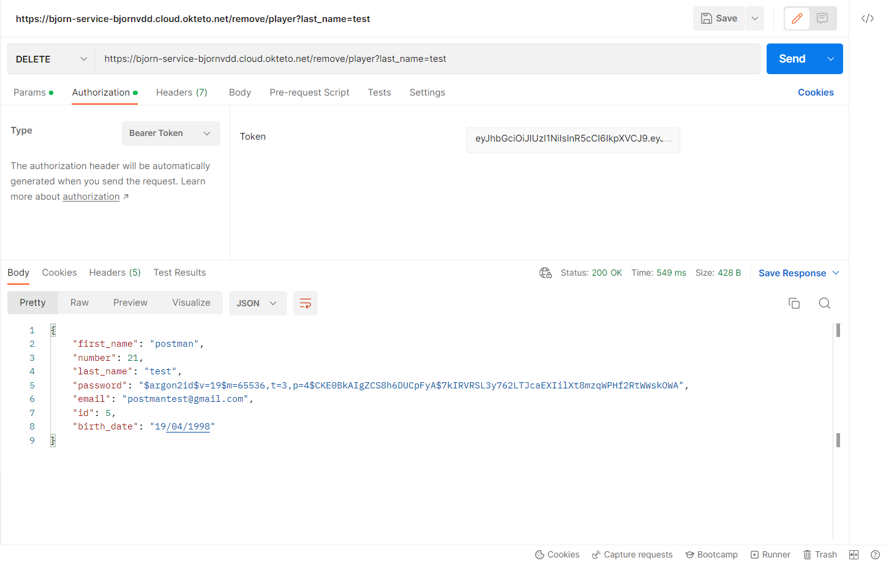

# Eindproject-Voetbal-API
#### Gemaakt door Bjorn Van den Dungen
#### r0889357

### Handige links bij project (API)

<a href="https://bjorn-service-bjornvdd.cloud.okteto.net">Link naar hosted API</a>

<a href="https://github.com/bjornvdd/eindproject_frontend">Link naar front-end Github repository</a>

<a href="https://bjorn-api.netlify.app">Link naar <strong>hosted</strong> front-end</a>

## Over het thema:
Ik heb besloten om mij verder te verdiepen in mijn basisproject die ik al gerealiseerd had, alleen nu is alles anders aangepakt, veel lees plezier :). In mijn API heb ik password hashing & OAuth geimplementeerd. De data die word aangemaakt wordt ook opgeslagen in een database namelijk 'sqlite.db'. Het is dus niet identiek t.o.v het basisproject. De API is nu meer beveiligd, niet iedereen kan de API gebruiken. Alleen bevoegde personen kunnen met de juiste credentials de API bedienen.

## Uitbreidingen:

* Functie: 2.1 / 2.2 = 20% 
* Front-end: 3.1 / 3.1.1 / 3.1.2 = 35%

## Over de front-end:

Ik heb ook een front-end pagina erbij gerealiseerd die ik host op 'netlify'.

Front-end pagina: <a href="https://bjorn-api.netlify.app">Link naar <strong>hosted</strong> front-end</a>

## Over de API:
API bevragen via URL: *https://bjorn-service-bjornvdd.cloud.okteto.net*

### POST requests:
* Post-request Token = hier kan je bv met een "authenticated" user in loggen om een "Bearer" token te verkrijgen
* Post-request make/player = hier kan je een speler aanmaken met een password die gehashed is.
* Post-request make/team = hier kan je een team aanmaken die opgeslagen wordt in de database.
* Post-request make/stadium = hier kan je bv een nieuwe stadium aanmaken waarin de spelers hun wedstrijd spelen

### GET-requests:
* Get-request all/players = hier kan je alle **spelers** terugvinden, die in de database zijn aangemaakt
* Get-request all/teams = hier kan je alle **teams** terugvinden, die in de database zijn aangemaakt
* Get-request all/stadiums = hier kan je alle **stadiums** terugvinden, die in de database zijn aagemaakt
* Get-request team/rank = hier kan je een specifiek team opvragen die bv 1ste,2de of 3de plaats is in de ranking.

### Delete-request:
* Delete-request remove/player = hier kan je een speler verwijderen op basis van de achternaam. Dus als je zijn achternaam invult wordt de speler uit de database verwijderd.

### Put-requests:

* Put-request change/player = hier kan je een player zijn naam veranderen op basis van zijn id (player_id) die je meegeeft.
* Put-request change/captain = hier kan je een captain (uit team) veranderen op basis van zijn id (team_id) die je meegeeft. Het kan natuurlijk voorvallen dat er een andere kapitein wordt gekozen door de coach. Dus daarom heb ik dit voorzien in mijn API.

### Overview API:

### OAuth verificatie

* Status: niet ingelogd

* Status: wel ingelogd

### Password hashing (voorbeeld):

Hier zie je dat het paswoord niet zomaar 'plain text' is.

### Postman Screenshots:
Vervolgens ga ik de API bevragen op Postman.

* Post-request: make player

* Post-request: make team

* Post-request: make stadium

* Get-request: all players

* Get-request: all teams

* Get-request: all stadiums

* Get-request: team rank

* Delete-request: remove player

* Put-request: change player

* Put-request: change captain

### OPENAPI Screenshots:

* Post-request: make token

* Post-request: make player

* Post-request: make team

* Post-request: make stadium

* Get-request: all players

* Get-request: all teams

* Get-request: all stadiums

* Get-request: team rank

* Delete-request: remove player

* Put-request: change player

* Put-request: change captain

## Uitbreiding screenshots:

<a href="#uitbreiding">Uitbreiding</a>

### 2.1 Test alle GET endpoints:

* Python code:

* Alle GET- requests:

* Verficatië GET-requests:

<a href="#readme-back-top">Back to top</a>

